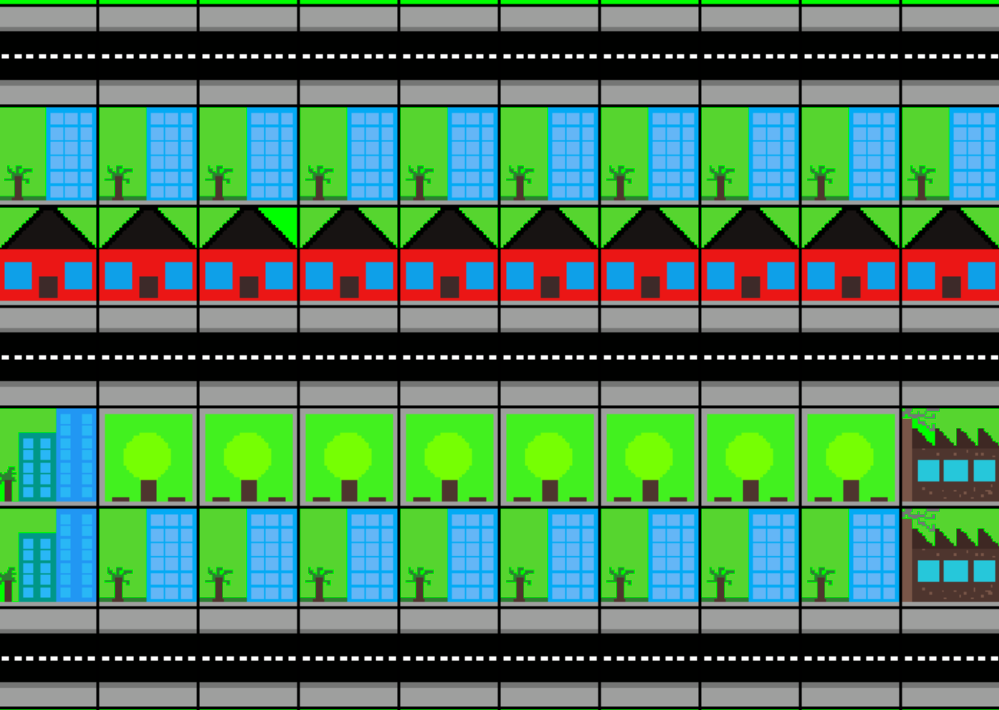

This project has been deprecated. This is being superceded by a new project PyCity 3D (name not decided)

# PyCity-simulation


## Installation

  To play PyCity, you first have to install pygame to install pygame open cmd or terminal and type:

  For linux:
```
$ sudo apt update
```
```
$ pip3 install pygame
```
  For Windows:

```
pip install pygame
```
  For more info visit:
[https://www.pygame.org/wiki/GettingStarted](https://www.pygame.org/wiki/GettingStarted)

>   When you got pygame installed cilck green "Clone or download" and click download .zip or clone it with git

  Once the download completes, unzip it and go to src folder.
  Open up Windows Command Prompt or Terminal (in Mac and Linux) and run the following command:
```
python pycity.py
```
  For Linux, you may need to run it like this.

```
$ python3 pycity.py
```
## How to play?

It's simple like in other city building games.


## Building
  Enter map size, diffculty, city name and press ENTER the game window should appear
  To build hover with your mouse cursor over a square where you want to build and press one of the following keys:
+ R - build rezidential zone
+ C - build comercial zone
+ O - build road
+ L - build police station
+ F - build fire station
+ H - build hospital
+ S - build prison
+ P - build park
+ I - build industrial zone
+ E - remove anything
## Indicators
  If you see square in right in one of following colors
+ Light blue - Police station needed
+ Blue - Comercial zone needed
+ Red - Fire station needed
+ Brown - Industrial zone needed
+ Grey - Prison needed
+ White - Hospital needed
## Land value
  Building parks increase land value, so, more parks = better rezidential zones

Thank you for trying out PyCity.

Enjoy!

Don't forget to join my discord server: https://discord.gg/puuF2BbRwU
